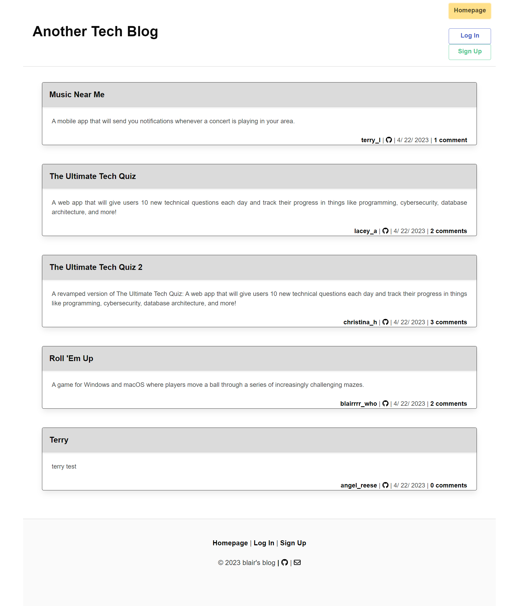

# MVC Tech Blog

## Description
Model-View-Controller Tech Blog: A MySQL database and CMS-style blog that follows the Model-View-Controller (MVC) paradigm in its architectural structure, using Handlebars.js as the templating language, Sequelize as the ORM, and the express-session npm package for authentication.ort description explaining the what, why, and how of your project. Use the following questions as a guide:

## Table of Contents
- [Installation](#installation)
- [Usage](#usage)
- [Deployment](#deployment)
- [Features](#features)
- [Technologies](#technologies)
- [License](#license)
- [Tests](#tests)
- [Credits](#credits)
- [Contribution](#how-to-contribute)
- [Contact / Questions](#contact--questions)

## Installation
To install simply clone the repo down to your local machine. In the CLI in the relative directory, run 'npm i' to get all dependancies required for sucessful download of packages. Download mMSQL, then create db by using 'SOURCE db/schema.sql' in mySQL shell. Ensure that you have updated the /config/connection.js to use your mySQL with sequelize. Finally run 'npm run seed' to seed the db with default data.  
Add the .env file to the root of the project and change the following: 
- DB_NAME='tech_blog_db'
- DB_USER='root'
- DB_PASSWORD='YOURPASSWORD'

## Usage (Instructions/How-To Use)
To use the package as a consumer, simply visit the deployed link and create an account. After signing up, You can create blog posts by clicking the create button on the home page. Comment by clicking an existing post, and below that you will have the option to make a comment. You can visit the dashboard to view your own posts. Just click Dashboard in the navbar. Here, you can create, edit, or delete your posts. 

To use the package as a Developer, after following the installation steps above, at the root of the project directory run command 'npm start' or 'npm run dev' in your CLI, then click the link in the CLI to view site from localhost.

## Deployment
Live URL: <a href="https://another-mvc-tech-blog.herokuapp.com/">Another Tech Blog</a>

## Features
Lots of npm packages are featured!  
Some of them include:
- bcrypt
- nodemon
- bulma

## Technologies
JavaScript, HTML, CSS, Node.js, Express.js, MySQL, Handlebars

## License
This project is licensed under the MIT license. For more information about this license and what it entails, visit the MIT website <a href="https://opensource.org/licenses/MIT">here</a>  

Preview:

    Permission is hereby granted, free of charge, to any person obtaining a copy of this software and associated documentation files (the “Software”), to deal in the Software without restriction, including without limitation the rights to use, copy, modify, merge, publish, distribute, sublicense, and/or sell copies of the Software, and to permit persons to whom the Software is furnished to do so, subject to the following conditions:

    The above copyright notice and this permission notice shall be included in all copies or substantial portions of the Software.

    THE SOFTWARE IS PROVIDED “AS IS”, WITHOUT WARRANTY OF ANY KIND, EXPRESS OR IMPLIED, INCLUDING BUT NOT LIMITED TO THE WARRANTIES OF MERCHANTABILITY, FITNESS FOR A PARTICULAR PURPOSE AND NONINFRINGEMENT. IN NO EVENT SHALL THE AUTHORS OR COPYRIGHT HOLDERS BE LIABLE FOR ANY CLAIM, DAMAGES OR OTHER LIABILITY, WHETHER IN AN ACTION OF CONTRACT, TORT OR OTHERWISE, ARISING FROM, OUT OF OR IN CONNECTION WITH THE SOFTWARE OR THE USE OR OTHER DEALINGS IN THE SOFTWARE.

## Tests
Endpoints were tested with Insomnia, If you should find any issues, see above on contibuting guidlines, or submit a issue with a detailed explanation on how to recreate the bug.

## Credits
Terry Lequernaque!

## How to Contribute
How to contribute? fork the repo and clone down to your local machine. Once you have the latest version of the repo you can add or make changes then submit a pull request for your changes. Please use best practices as well as proper naming conventions and comments depicting what the code segements function is. Finally in the body of your pull request please explain why these changes you were necissary and if it is a bug what steps can be completed to reproduce this bug. If these guidelines are not met, pull requests will not be reviewed or accepted.

## Contact / Questions
  If you liked this project and want to see more, feel free to check out my other repos [here](https://github.com/blairrrrwho).  
  For any questions or inquiries, you can reach me at blair10324@gmail.com for further information.

  <li><strong><a href="https://github.com/blairrrrwho" target="_blank">Blair Millet</a>:</strong> Full-Stack Developer</li>  

- - - - 
© 2023 Another Tech Blog, Inc. All Rights Reserved.